# SafePlant WEB Test Project Java

[](https://www.java.com/)
[](https://maven.apache.org/)
[](https://testng.org/)
[](https://www.selenium.dev/)
[](https://allurereport.org/)

---

Это репозиторий для проекта по автоматизации тестовых сценариев для сайта Safe Plant web с
использованием UI тестов.

## Содержание

- [🛠️ Технологический стек](#-технологический-стек)
- [✅ Установка проекта локально](#-установка-проекта-локально)
- [🚀 Запуск тестов](#-запуск-тестов)
- [⚙️ Файл конфигурации](#-файл-конфигурации)
- [⛔ Добавление конфиденциальных данных](#-добавление-конфиденциальных-данных)
- [📄️ Отчет о тестировании](#--отчет-о-тестировании)
- [📄️ Работа с CI](#-работа-с-ci)

---

## 🛠️ Технологический стек

<p align="center">
  <a href="https://www.jetbrains.com/idea/" rel="nofollow"></a>
  <a href="https://www.java.com/" rel="nofollow"></a>
  <a href="https://www.selenium.dev/" rel="nofollow"></a>
  <a href="https://maven.apache.org/" rel="nofollow"></a>
  <a href="https://testng.org/" rel="nofollow"></a>
  <a href="https://allurereport.org/" rel="nofollow"></a>
  <a href="https://github.com/" rel="nofollow"></a>
  <a href="https://github.com/features/actions" rel="nofollow"></a>
</p>

- **Язык программирования:** Java 17
- **UI тестирование:** Selenium
- **Сборка:** Maven
- **Тестовый фреймворк:** TestNG
- **Шаблон проектирования:** Page Object Model (POM)
- **Отчетность:** Allure Report
- **CI/CD:** GitHub Actions, который создаёт Allure отчёт и публикует результаты на GitHub Pages.


**Содержание Allure отчёта:**

- Шаги тестов
- Автоматические скриншоты для упавших UI-тестов (кроме тестов с секретными данными)
- Page Source для упавших UI-тестов

---

## ✅ Установка проекта локально

1. В выбранной локально директории открываем командную строку и выполняем команду
```bash
   git clone https://github.com/MapGary/SP-WEB-UI
```
2. На основе шаблона `defauilt.properties.TAMPLATE` создать файл `demo.properties` с данными для входа без vpn
3. Обязательно локально установить Yandex браузер
4. Подгрузить / обновить файл зависимостей для Maven pom.xml
<p align="center">  </p>


## 🚀 Запуск тестов

### Команды для запуска:

Тесты запускаются с помощью файла `*.xml`, работают с браузерами: Yandex, Edge, Chrome.

Команда для запуска по умолчанию (без указания параметров) выполняется в одном браузере Yandex (это браузер по умолчанию), файл `singleBrowser.xml` запускает тесты указанные в нем:

   ```bash     
       mvn clean test       
   ```
или так (с параметром указывающим на файл запуска без `.xml`)
```bash     
       mvn clean test -Dsuite=singleBrowser      
   ```

Команда для запуска всех тестов указанных в `all.xml` в каждом из браузеров Chrome, Edge, Yandex:

   ```bash     
       mvn clean test -Dsuite=all       
   ```

Команда для параллельного запуска тестов указанных в `parallel.xml` 3 потока в каждом из браузеров Chrome, Edge, Yandex:

   ```bash     
       mvn clean test -Dsuite=parallel       
   ```

Команда для запуска тестов указанных в `singleBrowser.xml` только в Yandex:

```bash
    mvn clean test -Dbrowser=yandex
```
или так 
```bash
    mvn clean test -Dsuite=singleBrowser -Dbrowser=yandex
```

Команда для запуска тестов указанных в `singleBrowser.xml` только в Chrome:

```bash
    mvn clean test -Dbrowser=chrome
```
или так
```bash
    mvn clean test -Dsuite=singleBrowser -Dbrowser=chrome
```

Команда для запуска тестов указанных в `singleBrowser.xml` только в Edge:

```bash
    mvn clean test -Dbrowser=edge
```
или так
```bash
    mvn clean test -Dsuite=singleBrowser -Dbrowser=edge
```

---

## ⚙️ Файл конфигурации

На проекте есть возможность запускать тесты по разными окружениями (пока не работает). Для этого нужно создать файлы `*.properties` на основе шаблона `defauilt.properties.TAMPLATE`

1. Окружение `demo` то которое работает без VPN. Файл должен называться `demo.properties` Использовать в крайнем случае!!!
    ```bash
      mvn clean test -Denv=demo
   ```
1. Окружение `vpn` то которое работает с VPN. Это окружение запускается по дефолту. На устройстве должен быть настроен и подключен VPN. Файл должен называться `vpn.properties`
    ```bash
      mvn clean test -Denv=vpn
   ```


## ⛔ Добавление конфиденциальных данных

При работе с проектами может возникнуть необходимость передавать не только baseUrl, но и логины, пароли, API-ключи. Ни в коем случае не храните такие данные в коде! Это может привести к утечке данных и компрометации учетных записей.

Одним из возможных вариантов является использование properties файлов, в которых значения переменных будет храниться только локально.
А в CI/CD данные поля можно будет передать как secret параметры на уровне самой джобы.

Алгоритм действий:
1. Создайте копию файла `default.properties.TEMPLATE`, удалите изназвания `.TEMPLATE`
2. Добавьте ключи для секретных данных, но без значений, и закоммитьте
```properties
baseUrl=
userName=
password=
```
3. Добавьте .properties файлы в .gitignore, чтобы Git перестал их отслеживать
```gitignore
src/test/resources/*.properties
```
4. Добавьте секретные значения локально и убедитесь, что они не попадают в коммиты
```properties
baseUrl=url
userName=username
password=password
```
5. Дополнительно: Если нужно перестать отслеживать изменения в файле, можно выполнить комманду:
```bash
git rm --cached src/test/resources/default.properties
```

## ️ 📄️ Отчет о тестировании

Генерация Allure отчета локально (на своем компьютере)

1. Открыть модуль `Maven`
<p align="center"> 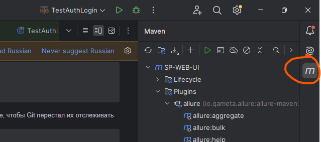 </p>

2. Кликнуть `Plugins`, перейти в `allure`
<p align="center"> 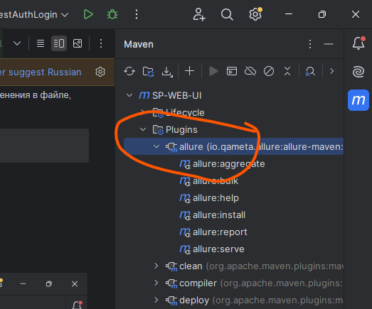 </p>

3. Кликнуть `allure:report`
<p align="center"> 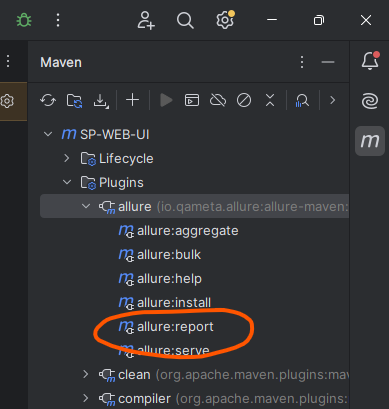 </p>

4. Дождаться выполнения
<p align="center"> 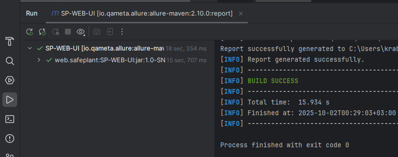 </p>

5. Найти папку `target` далее `site` открыть `index.html`
<p align="center"> 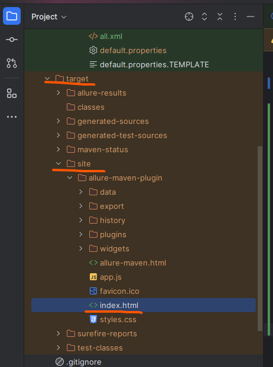 </p>

6. Открыть в одном из предложенных браузеров
<p align="center"> 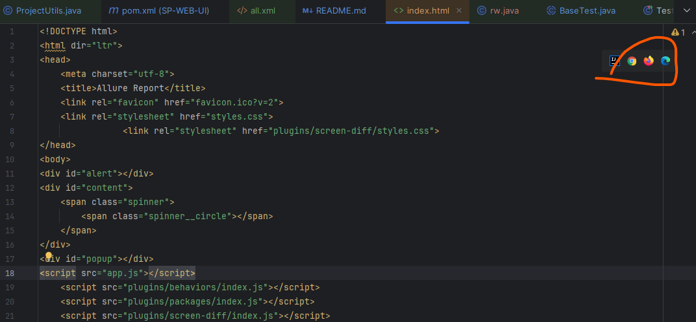 </p>

7. Посмотреть отчет
<p align="center"> 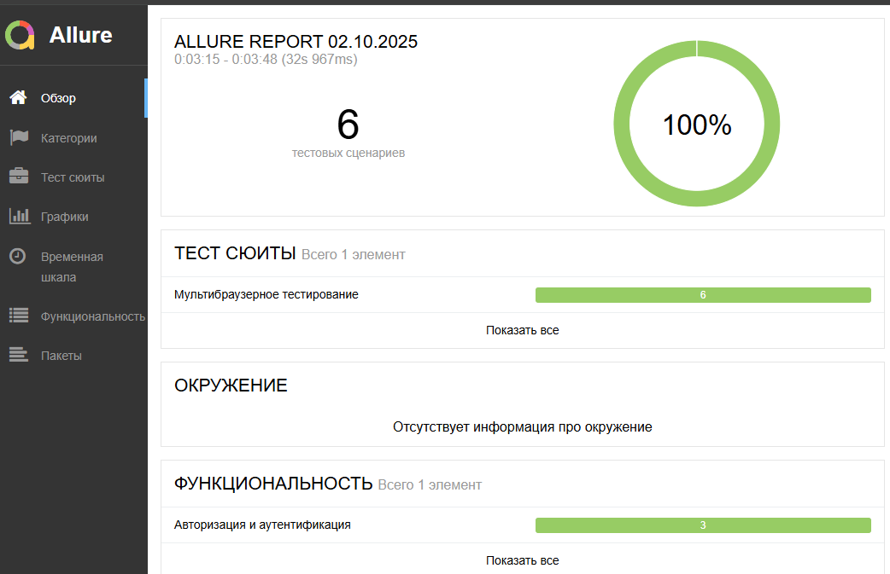 </p>

## 📄️ Работа с CI

CI настроен на работу с demo окружением (которое без vpn). 
Тесты запускаются самостоятельно с помощью команды `mvn clean test -Dsuite=all` после создания Pull requests или Push в репозиторий.

Тесты можно запустить в любой момент времени самостоятельно:
1. В репозитории перейти на вкладку `Actions`
2. В правом меню выбрать `Java CI with Maven`
3. Кликнуть кнопку `Run workflow`
4. Дождаться пока пройдут тесты и сгенерируется Allure отчет
<p align="center"> 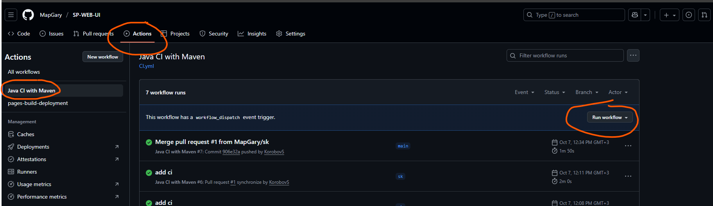 </p>

Как посмотреть отчет:

1. В репозитории перейти на вкладку `Code`
<p align="center"> 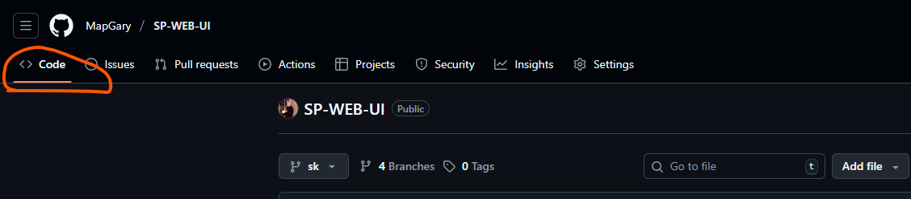 </p>

2. В левом меню кликнуть `github-pages`
<p align="center"> 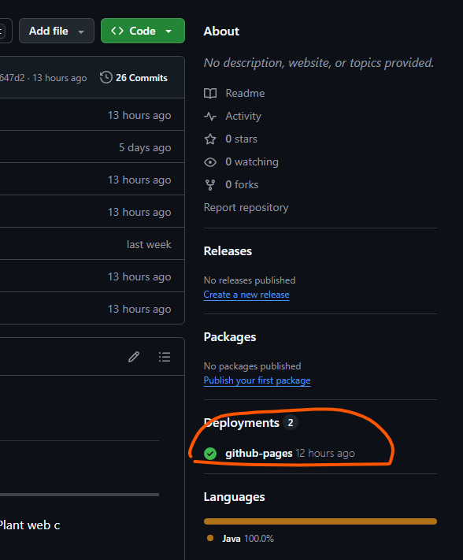 </p>

3. Кликнуть по ссылке
<p align="center"> 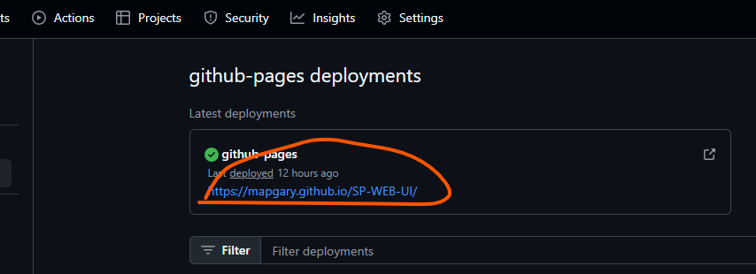 </p>

4. Подгрузится Allure отчет
<p align="center"> 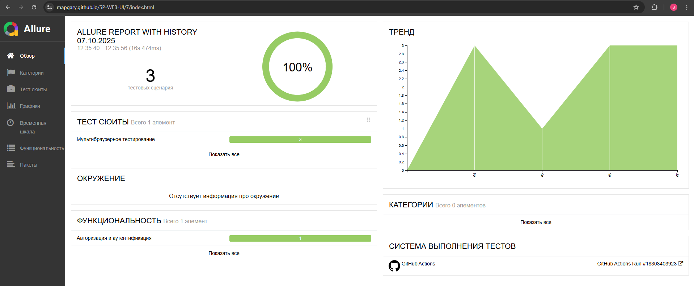 </p>
